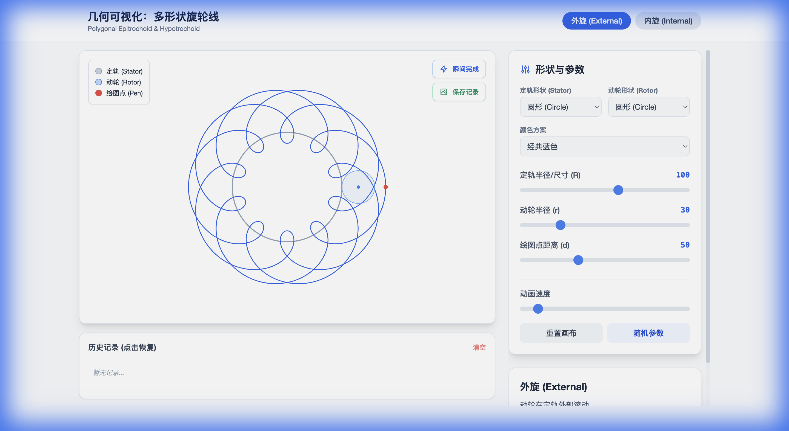

# 多形状旋轮线可视化 / Polygonal Spirograph Visualizer

一个交互式的几何可视化工具，支持多种形状（圆形、椭圆、多边形）的旋轮线绘制，可创造出无限多样的美丽几何图案。

An interactive geometric visualization tool for drawing spirograph patterns with various shapes (circles, ellipses, polygons), creating infinitely diverse beautiful geometric patterns.

**🎨 [在线演示 / Live Demo](https://holynova.github.io/spinning-drawer/)**

---

**Features / 功能特点:**
- 🔵 External/Internal modes (外旋/内旋模式)
- 🎨 7 color schemes (7种颜色方案)
- � Multiple shapes support (多种形状支持)
- ⚡ Instant complete & history (瞬间完成 & 历史记录)
