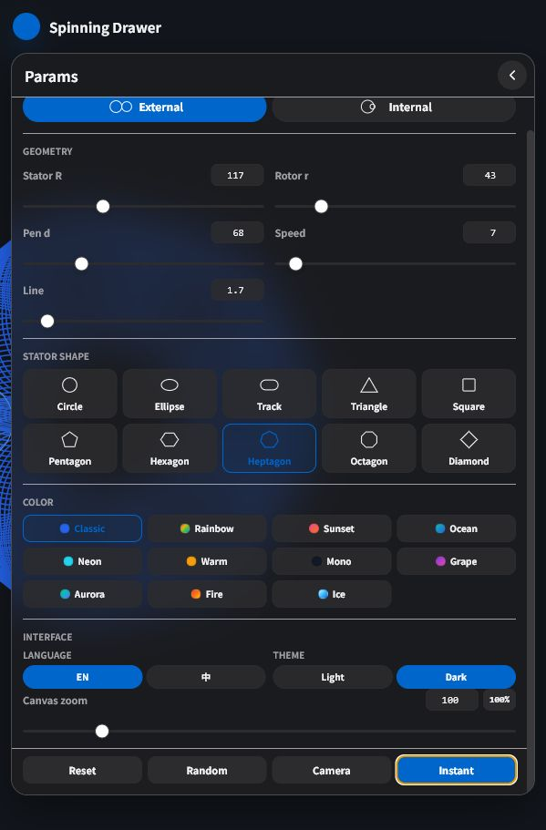

# Spinning Drawer

An interactive canvas tool for drawing spirograph-inspired rolling curves with circular, elliptical, track, and polygonal stators.

[Live Demo](https://holynova.github.io/spinning-drawer/)

[Cloudflare Demo](https://spinning-drawer.xiaosang.cc/)



## Features

- External and internal rolling modes.
- Circle, ellipse, track, triangle, square, pentagon, hexagon, heptagon, octagon, and diamond stator shapes.
- Adjustable stator radius, rotor radius, pen offset, animation speed, line width, pan, and zoom.
- Compact floating parameter panel with dark mode by default.
- Multiple color palettes, including classic, rainbow, neon, aurora, fire, and ice.
- Instant render mode for quickly completing a drawing.
- Camera tool that generates an elegant share card with the project name, artwork, parameter summary, page link, and QR code.

## Usage

Open `index.html` directly in a browser, or serve the folder locally:

```bash
python -m http.server 8765 --bind 127.0.0.1
```

Then visit:

```text
http://127.0.0.1:8765/index.html
```

## Notes

The app is a single-file HTML/CSS/JavaScript project. It is published as root-directory static assets; no build step is required. The share-card QR code is generated from the current page URL, so use the hosted demo URL when creating cards intended for others.
