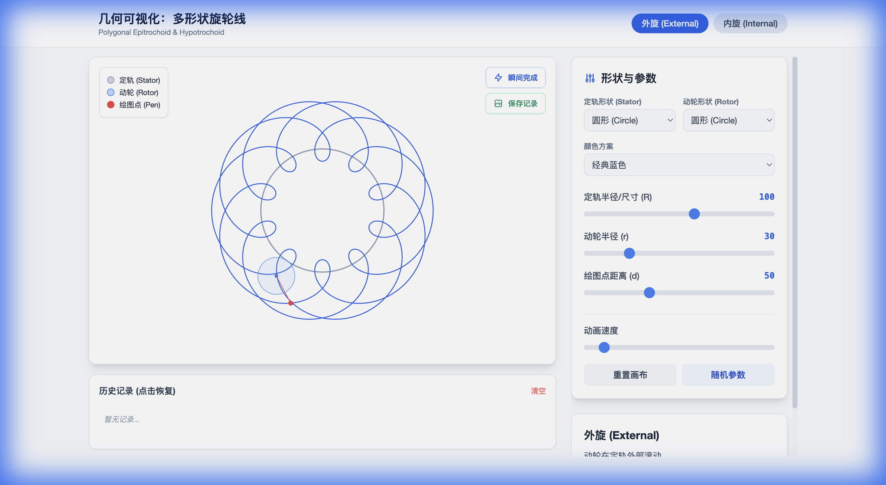
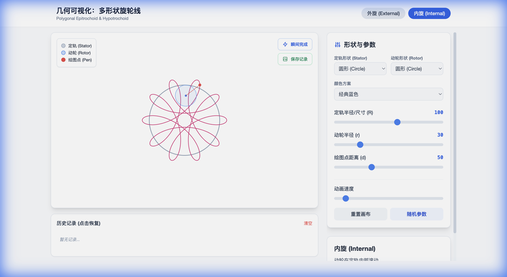

# 多形状旋轮线可视化 / Polygonal Spirograph Visualizer

[English](#english) | [中文](#中文)

---

## 中文

### 📖 项目简介

这是一个交互式的几何可视化工具，用于绘制和探索多种形状的旋轮线（Epitrochoid 和 Hypotrochoid）。通过动态调整参数，您可以创造出无限多样的美丽几何图案。

### ✨ 主要功能

- **双模式绘制**
  - 🔵 外旋模式（Epitrochoid）：动轮在定轨外部滚动
  - 🔴 内旋模式（Hypotrochoid）：动轮在定轨内部滚动

- **多种形状支持**
  - 定轨形状：圆形、椭圆、跑道形、三角形、正方形、五边形、六边形
  - 动轮形状：圆形、三角形、正方形、五边形

- **丰富的颜色方案**
  - 经典蓝色、彩虹渐变、日落渐变、海洋蓝绿、霓虹赛博、暖色调、黑白极简

- **实时交互控制**
  - 调节定轨半径/尺寸 (R)
  - 调节动轮半径 (r)
  - 调节绘图点距离 (d)
  - 动画速度控制

- **便捷功能**
  - ⚡ 瞬间完成：一键生成完整周期图案
  - 💾 历史记录：保存和恢复您喜欢的图案
  - 🎲 随机参数：快速探索新的图案组合

### 🖼️ 运行截图

#### 初始界面


#### 完整图案


#### 内旋模式


### 🚀 使用方法

1. **本地运行**
   ```bash
   # 直接在浏览器中打开 index.html 文件
   open index.html
   ```

2. **在线访问**
   - 访问 GitHub Pages 部署的在线版本：[https://yourusername.github.io/spinning-drawer/](https://yourusername.github.io/spinning-drawer/)

3. **操作说明**
   - 选择外旋或内旋模式
   - 选择定轨和动轮的形状
   - 调整参数滑块观察实时变化
   - 点击"瞬间完成"查看完整图案
   - 点击"保存记录"保存当前图案
   - 点击历史记录中的缩略图恢复之前的配置

### 🛠️ 技术栈

- HTML5 Canvas
- JavaScript (Vanilla)
- Tailwind CSS (CDN)
- 纯静态网页，无需后端

### 📐 数学原理

本项目实现了经典的旋轮线几何学，并扩展支持多边形和椭圆形状。对于非圆形状，使用查找表（LUT）和曲率自适应算法来保证纯滚动不打滑的物理真实性。

### 📄 许可证

MIT License

---

## English

### 📖 Project Description

An interactive geometric visualization tool for drawing and exploring spirograph patterns (Epitrochoid and Hypotrochoid) with various shapes. Create infinitely diverse beautiful geometric patterns by dynamically adjusting parameters.

### ✨ Key Features

- **Dual Drawing Modes**
  - 🔵 External Mode (Epitrochoid): Rotor rolls outside the stator
  - 🔴 Internal Mode (Hypotrochoid): Rotor rolls inside the stator

- **Multiple Shape Support**
  - Stator shapes: Circle, Ellipse, Track, Triangle, Square, Pentagon, Hexagon
  - Rotor shapes: Circle, Triangle, Square, Pentagon

- **Rich Color Schemes**
  - Classic Blue, Rainbow Gradient, Sunset Gradient, Ocean Blue-Green, Neon Cyber, Warm Tones, Monochrome

- **Real-time Interactive Controls**
  - Adjust stator radius/size (R)
  - Adjust rotor radius (r)
  - Adjust pen distance (d)
  - Animation speed control

- **Convenient Features**
  - ⚡ Instant Complete: Generate full-cycle pattern with one click
  - 💾 History: Save and restore your favorite patterns
  - 🎲 Randomize: Quickly explore new pattern combinations

### 🖼️ Screenshots

#### Initial View


#### Completed Pattern


#### Internal Mode


### 🚀 Usage

1. **Local Usage**
   ```bash
   # Simply open index.html in your browser
   open index.html
   ```

2. **Online Access**
   - Visit the GitHub Pages deployment: [https://yourusername.github.io/spinning-drawer/](https://yourusername.github.io/spinning-drawer/)

3. **Instructions**
   - Select external or internal mode
   - Choose stator and rotor shapes
   - Adjust parameter sliders to observe real-time changes
   - Click "Instant Complete" to view the full pattern
   - Click "Save Record" to save the current pattern
   - Click thumbnails in history to restore previous configurations

### 🛠️ Tech Stack

- HTML5 Canvas
- JavaScript (Vanilla)
- Tailwind CSS (CDN)
- Pure static webpage, no backend required

### 📐 Mathematical Principles

This project implements classical spirograph geometry and extends support to polygonal and elliptical shapes. For non-circular shapes, lookup tables (LUT) and curvature-adaptive algorithms ensure physically accurate pure rolling without slipping.

### 📄 License

MIT License
